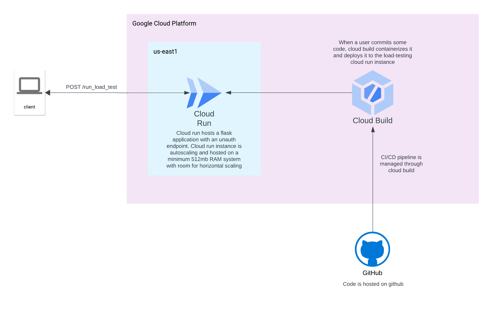

# load-testing

This is a website load testing service with the following features
 - url and number of requests parameterized
 - supports concurrency requests
 - calculates 50th, 75th, 95th, 99th percentile latencies
 - requests made through a POST endpoint

After running a load test, the endpoint returns
 - total requests completed
 - concurrency
 - total time for requests
 - average latency
 - percentiles

### Architecture diagram
 

This program is hosted on GCP's cloud run with autoscaling. CI/CD pipeline is managed via cloud build such that whenever code is pushed to `main`, cloud build packages and containerizes it, and builds and deploys it to cloud run.


### Testing locally
1. Clone the repository
2. Setup virtual environment
    - Install virtualenv: `pip install virtualenv`
    - Create a virtual environment: `virtualenv venv`
    - Activate virtualenv: Linux/macOS: `source venv/bin/activate`
3. Install dependencies: `pip install -r requirements.txt`
4. Adjust sample parameters within top-level code to your request
5. Run the program: `python HTTPLoadTest.py`


### Using the API
The service is hosted on `https://load-testing-djjegt4o7q-ue.a.run.app`

#### API Endpoints
| HTTP Verbs | Endpoints | Action |
| --- | --- | --- |
| POST | /run_load_test | To run load test on a website |

```http
POST https://load-testing-djjegt4o7q-ue.a.run.app/run_load_test
```

Sample Request Body
```
{
    "url": "https://www.google.com",
    "num_requests": 100,
    "concurrency": 4,
    "request_type": "GET"
}
```

Sample Response
```
{
    "average_latency": 0.5338004302978515,
    "concurrency": 4,
    "errors": 0,
    "percentiles": {
        "percentile_50th": 0.5479679107666016,
        "percentile_75th": 0.5910550355911255,
        "percentile_95th": 0.6173677563667297,
        "percentile_99th": 0.795107543468476
    },
    "total_requests": 100,
    "total_time": 13.496866941452026
}
```

### Future improvements
 - error handling around invalid requests with accurate HTTP response codes. For this project any errors are returned back as 500 and cloud run re-instantiates the server.
 - authenticated endpoint access.
 - endpoint DDOS protection by Cloud Armor firewall rules.
 - requests saved to DB and then visualized
 - Deployment on compute engine VM with multi-region instances connected with a global load balancer. With cloud run, instances can only be deployed in a single region.